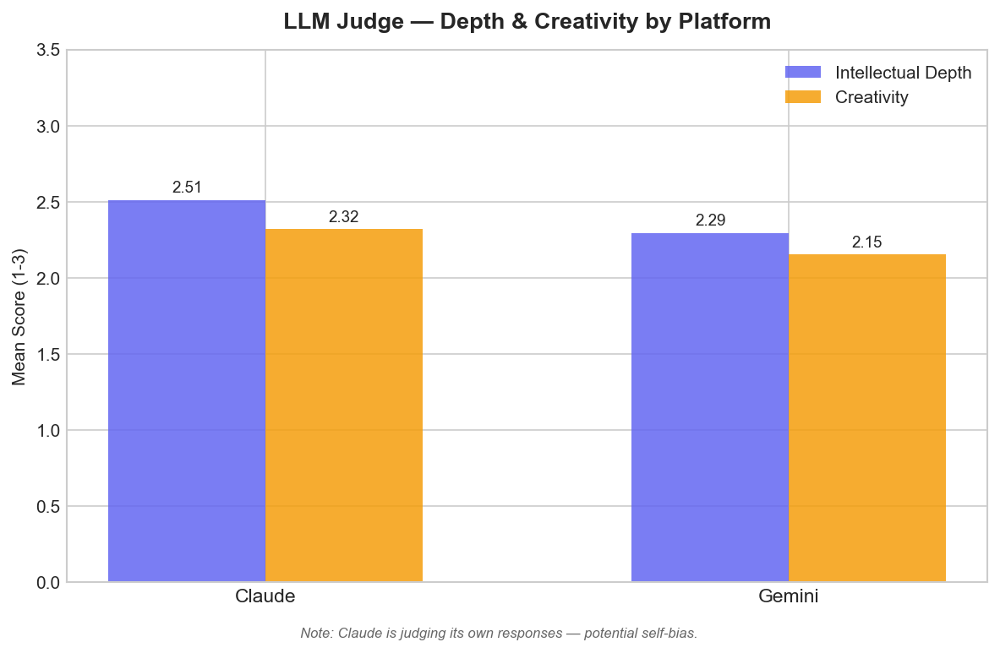
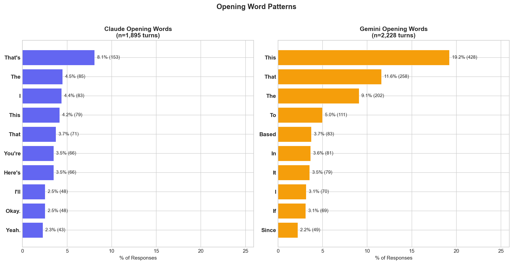
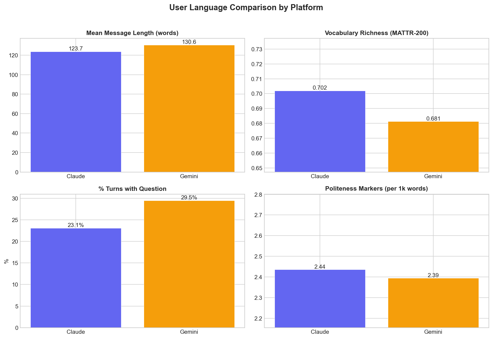
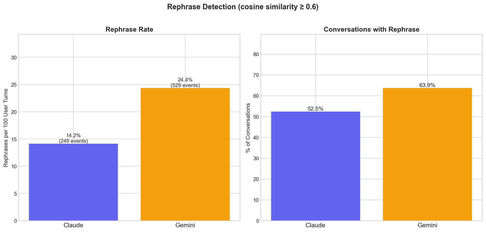

# Chatbot Conversation Analysis

A Python toolkit that ingests your conversation exports from **Claude**, **Gemini**, and **ChatGPT**, normalizes them into a common schema, and runs linguistic, semantic, and LLM-as-judge analyses to compare how each platform writes, thinks, and talks.

The goal is insight over volume. Not just word counts, but patterns in hedging language, intellectual depth, conversational style, and how your own writing shifts depending on which bot you're talking to.

---

## Sample Findings

Analysis of ~220 conversations across Claude and Gemini surfaces clear personality differences.

### LLM-as-Judge: Depth & Creativity

Claude Sonnet scored 400 sampled responses (200 per source) on intellectual depth and creativity using a 3-point rubric:



Claude scores higher on both depth (2.51 vs. 2.29, p=0.006) and creativity (2.32 vs. 2.15, p=0.037). Both differences are statistically significant (Mann-Whitney U). **Caveat**: Claude is judging its own responses here, creating a potential self-evaluation bias. Cross-reference with the traditional NLP metrics below.

### Opening Moves

How each model starts its response reveals its default conversational stance:



Claude leads with acknowledgment ("That's", "You're", "Yeah") while Gemini leads with analysis ("This", "Based", "To"). One validates, then answers. The other answers immediately.

### The User Changes Too

The same person writes differently depending on which bot they're talking to:



Users deploy a richer vocabulary with Claude (MATTR 0.70 vs. 0.68) and ask more questions on Gemini (29.5% of turns vs. 23.1%). Politeness markers are nearly identical across both — the user's courtesy is platform-independent, but their linguistic complexity isn't.

### The Rephrase Gap

Users rephrase their questions — retry with different wording after an unsatisfying answer — nearly **twice as often** on Gemini (24.4%) as on Claude (14.2%):



This is arguably the most telling user-satisfaction signal in the dataset. If you have to re-ask, the first answer didn't land.

---

## Analysis Modules

| Module | What it measures |
|---|---|
| **Lexical** | Vocabulary richness (MATTR), TF-IDF distinctive words, readability scores, sentence statistics, markdown formatting density |
| **Semantic** | BERTopic topic modeling (assistant + user turns), embedding self-similarity (formulaicness), sentiment distribution |
| **Pragmatic** | Hedging language, question rates, disclaimer frequency, verbosity ratios, first-person usage, opening patterns |
| **Comparative** | Cross-platform style fingerprints, topic-controlled comparisons, user language adaptation analysis |
| **Temporal** | Monthly trends in response length, vocabulary richness, hedging rates, user effort, inflection point detection |
| **Conversation Structure** | Turn dynamics, conversation depth, resolution patterns, rephrase detection via embedding similarity |
| **User Behavior** | How your own writing shifts per platform — formality, prompt engineering patterns, vocabulary, message classification |
| **LLM Judge** | Claude-as-judge evaluation of intellectual depth and creativity on sampled responses (requires API key) |

### Visualizations

22 plot types generated automatically, including: style fingerprint radar, vocabulary comparison, response length distributions, hedging breakdowns, verbosity ratios, opening patterns, activity timelines, user formality comparison, rephrase rates, depth distribution, and LLM judge score charts. All saved to `data/outputs/plots/`.

---

## Getting Started

### Prerequisites

- Python 3.11+
- ~2 GB disk space for models (sentence-transformers, spaCy)

### Installation

```bash
git clone https://github.com/YOUR_USERNAME/chatbot-analysis.git
cd chatbot-analysis

# Option A: use the setup script
chmod +x setup.sh && ./setup.sh

# Option B: manual
pip install -r requirements.txt
python -m spacy download en_core_web_sm
mkdir -p data/raw/claude data/raw/gemini data/raw/chatgpt data/processed data/outputs/plots
```

### Preparing Your Data

Drop your export file into the corresponding directory:

- **Claude**: [claude.ai](https://claude.ai) > Settings > Account > Export Data > extract `conversations.json` > `data/raw/claude/`
- **Gemini**: [takeout.google.com](https://takeout.google.com) > Deselect All > select "My Activity" > under "Activity Records" select only "Gemini Apps" > extract `MyActivity.html` > `data/raw/gemini/`
- **ChatGPT**: [chatgpt.com](https://chatgpt.com) > Settings > Data Controls > Export Data > extract `conversations.json` > `data/raw/chatgpt/`

### Running the Pipeline

```bash
python main.py inspect                        # Preview raw data structure
python main.py parse                           # Normalize to common format
python main.py analyze                         # Run all analysis modules
python main.py analyze --module lexical        # Run a single module
python main.py visualize                       # Generate all charts
python main.py report                          # Generate narrative report
```

#### LLM Judge (optional, requires API key)

The LLM judge module calls the Anthropic API and is **not** included in a bare `analyze` run to avoid accidental spend.

```bash
export ANTHROPIC_API_KEY=sk-ant-...

# Preview the sample, rubrics, and estimated cost before spending money
python main.py analyze --module llm_judge --dry-run

# Run the full evaluation (~$3-4 for 400 turns)
python main.py analyze --module llm_judge
```

Results cache to `data/processed/llm_judge_cache.json`, so interrupted runs resume where they left off.

All commands read paths and parameters from `config.yaml`.

---

## Architecture

```
chatbot-analysis/
├── src/
│   ├── parsers/              # Per-platform parsers -> common Conversation schema
│   │   ├── base.py           #   Turn/Conversation dataclasses + abstract BaseParser
│   │   ├── claude_parser.py  #   JSON: conversations with typed content blocks
│   │   ├── gemini_parser.py  #   HTML Takeout: markdownify conversion, time-gap threading
│   │   └── chatgpt_parser.py #   JSON: tree-walking parser (stub, awaiting data)
│   │
│   ├── analysis/             # Independent modules, each exposing run() -> dict
│   │   ├── lexical.py        #   Surface-level language (TTR, TF-IDF, readability)
│   │   ├── semantic.py       #   Embeddings, BERTopic, self-similarity, sentiment
│   │   ├── pragmatic.py      #   Hedging, disclaimers, verbosity, opening patterns
│   │   ├── comparative.py    #   Style fingerprints, topic-controlled comparisons
│   │   ├── temporal.py       #   Metric trends over time, inflection detection
│   │   ├── conversation_structure.py  # Depth, rephrase, resolution patterns
│   │   ├── user_behavior.py  #   User language adaptation across platforms
│   │   └── llm_judge.py      #   Claude-as-judge: depth + creativity scoring
│   │
│   └── viz/
│       └── plots.py          # 22 visualization functions + registry
│
├── data/
│   ├── raw/                  # Your export files (gitignored)
│   ├── processed/            # Normalized parquet + embedding caches (gitignored)
│   └── outputs/              # Charts, reports, analysis JSON
│
├── main.py                   # CLI entrypoint (click): inspect, parse, analyze, visualize, report
└── config.yaml               # All configurable parameters
```

Each analysis module is self-contained: it takes a `list[Conversation]` and config dict, returns a results dict, and can run independently. Visualization logic is fully separated from analysis — `plots.py` consumes the JSON output files.

---

## Methodology

**Common schema normalization.** All platforms export differently. Claude provides clean JSON with typed content blocks. Gemini exports as Google Takeout HTML, which is converted to Markdown via `markdownify` and threaded into conversations using 60-minute time-gap heuristics. ChatGPT exports as JSON with a tree structure of message nodes. The parsers normalize everything into a shared `Conversation` > `Turn` schema with source, role, content, and timestamps.

**Known data limitations.** Gemini auto-capitalizes user messages, making user-side capitalization analysis unreliable for that source. Gemini conversation boundaries are inferred (not native), so some conversations may be mis-segmented. Sentiment analysis uses a lexicon-based approach (VADER) that skews negative for technical content.

**LLM-as-Judge bias.** The judge module uses Claude to score responses from both Claude and Gemini. This creates a conflict of interest — Claude may unconsciously favor its own style. The depth and creativity scores should be cross-referenced with the traditional NLP metrics, which carry no such bias.

**Privacy.** All analysis runs locally using `all-MiniLM-L6-v2` (sentence-transformers) and `en_core_web_sm` (spaCy). No data leaves your machine. The only exception is the optional LLM judge module, which sends conversation excerpts to the Anthropic API. `data/raw/` and `data/processed/` are gitignored by default.

---

## Project Status

| Platform | Parser | Analysis |
|----------|--------|----------|
| Claude   | Done | Done |
| Gemini   | Done | Done |
| ChatGPT  | Stub ready | Awaiting data export |

---

## License

[MIT](LICENSE)
